<!-- ═══════════════════════════════════════════════════════════════════ -->
<!--               ✦  ANIMATED HEADER BANNER  ✦                        -->
<!-- ═══════════════════════════════════════════════════════════════════ -->

<div align="center">




</div>

<!-- ─── SKILL ICON TICKER ─────────────────────────────────────────────── -->
<div align="center">

</div>

<br/>

<!-- ─── TYPING ANIMATION ──────────────────────────────────────────────── -->
<div align="center">


</div>

<br/>

<!-- ─── BADGE ROW ───────────────────────────────────────────────────────── -->
<div align="center">

[](https://github.com/sashikantcodex)
[](https://www.linkedin.com/in/sashikanta-sahoo-108688313)
[](mailto:sashikantgeek@gmail.com)
[](https://github.com/sashikantcodex/ai-knowledge-assistant-program)
[](mailto:sashikantgeek@gmail.com)

</div>


---

<!-- ═══════════════════════════════════════════════════════════════════ -->
<!--                   TERMINAL BOOT SEQUENCE                          -->
<!-- ═══════════════════════════════════════════════════════════════════ -->

## ⚡ `profile.load()`

```bash
$ ssh sashikanta@production --role SDE-4 --years 8

Authenticating... ████████████████████  100%  CONNECTED

┌─────────────────────────────────────────────────────────────┐
│  ENGINEER PROFILE — SASHIKANTA SAHOO                        │
├──────────────┬──────────────────────────────────────────────┤
│  role        │  SDE-4 · Senior AI Full Stack Engineer 🤖    │
│  company     │  IQVIA R&D Solutions · Bangalore 🇮🇳         │
│  domain      │  Healthcare Tech · Pharma R&D · HIPAA        │
│  experience  │  8+ years — production shipped, not just PR'd│
│  stack       │  React · Next.js · Node.js · TypeScript · AWS│
│  ai stack 🧠 │  Python · FastAPI · LangChain/LangGraph · RAG│
│  devops      │  Docker · Kubernetes · Jenkins · Terraform    │
│  security    │  JWT · RBAC · OWASP Top 10 · HIPAA Audits    │
├──────────────┼──────────────────────────────────────────────┤
│  impact      │  ~30% faster loads · ~40% faster deploys ⚡   │
│              │  ~20% faster APIs  · zero production outages  │
├──────────────┼──────────────────────────────────────────────┤
│  genai 🚀    │  RAG pipelines · structured extraction ·     │
│              │  citation-backed Q&A · secure LLM integration│
│  levelling   │  Agentic RAG · AWS Bedrock/SageMaker · CKA   │
│  seeking     │  Lead / Principal · Bangalore · Remote/Hybrid│
├──────────────┴──────────────────────────────────────────────┤
│  🟢  ONLINE — Building · Mentoring · Shipping               │
└─────────────────────────────────────────────────────────────┘

$ █
```

---

<!-- ═══════════════════════════════════════════════════════════════════ -->
<!--                     IMPACT DASHBOARD                              -->
<!-- ═══════════════════════════════════════════════════════════════════ -->

## 📊 Impact Dashboard

<div align="center">

<table>
<tr>
<td align="center" width="220">

<br/><br/>
<sub>API batching · Redis cache · Query optimisation</sub>
</td>
<td align="center" width="220">

<br/><br/>
<sub>Jenkins + AWS · 40 min → 25 min · Zero outages</sub>
</td>
<td align="center" width="220">

<br/><br/>
<sub>Full perf audit · Screen rebuild · Lazy loading</sub>
</td>
<td align="center" width="220">

<br/><br/>
<sub>Redis · Compound indexes · N+1 elimination</sub>
</td>
</tr>
</table>

<br/>

<table>
<tr>
<td align="center" width="280">

**🏥 Domain Expertise**
<br/>
`HIPAA` · `Clinical Platforms` · `Insurance`
<br/>
`Pharma R&D` · `Prior Auth` · `Audit Trails`

</td>
<td align="center" width="280">

**🔐 Security Architecture**
<br/>
`JWT` · `RBAC` · `OAuth 2.0` · `OWASP Top 10`
<br/>
`Multi-tenant isolation` · `HTTPS/TLS`

</td>
<td align="center" width="280">

**🎓 Technical Leadership**
<br/>
`Mentored 3 engineers` · `Tech Lead since 2022`
<br/>
`React lib → 3 product teams` · `Arch reviews`

</td>
</tr>
</table>

</div>


---

<!-- ═══════════════════════════════════════════════════════════════════ -->
<!--                    GENAI / AI ENGINEERING                         -->
<!-- ═══════════════════════════════════════════════════════════════════ -->

## 🤖 GenAI / AI Engineering

<div align="center">


<br/><br/>


<br/>


<br/><br/>


<sub>Pydantic · asyncio · PostgreSQL · SQLAlchemy · Alembic · Redis · Celery · Kafka · ChromaDB / Vector DBs</sub>

</div>

<br/>

<div align="center">

| 🤖 AI Project | Tech | Highlights |
|:---|:---|:---|
| 🧠 **[AI Knowledge Assistant](https://github.com/sashikantcodex/ai-knowledge-assistant-program)** | Next.js · Node/Express · FastAPI · MongoDB · ChromaDB · Gemini/OpenAI · WebSockets · JWT · Docker | Enterprise PDF/DOCX Q&A — semantic search, citation-backed RAG answers, conversational retrieval |
| 🧑‍💼 **[AI Recruitment Platform](https://github.com/sashikantcodex/ai-recruitment-platform)** | Next.js 16 · React 19 · Express 5 · FastAPI · MongoDB · OpenAI SDK · Docker Compose · GitHub Actions | Resume parsing, JD-resume scoring, policy RAG, interview-question generation, agent-style workflows |

</div>


---

<!-- ═══════════════════════════════════════════════════════════════════ -->
<!--                      ENGINEERING PHILOSOPHY                       -->
<!-- ═══════════════════════════════════════════════════════════════════ -->

## 💡 Engineering Philosophy

<div align="center">


</div>

<br/>

<div align="center">

<table>
<tr>
<td width="50%" valign="top">

```
⚡  Performance is a feature
    Every ms counts in healthcare workflows.
    No PR merges without before/after metrics.

🔐  Security is architecture, not a checklist
    HIPAA isn't a config flag — it's how
    you design every data flow from day one.

📦  Components should outlive your tenure
    Build shared libs others adopt.
    Good abstractions compound like interest.
```

</td>
<td width="50%" valign="top">

```
🧪  Code reviews are mentoring in disguise
    A comment that teaches > one that fixes.
    Pull the engineer up, not just the code.

📊  Metrics or it didn't happen
    If you can't measure the improvement,
    you didn't actually improve it.

🔄  Ship → Measure → Optimise → Repeat
    Until the architecture tells you
    it's time to rethink everything.
```

</td>
</tr>
</table>

</div>

---

<!-- ═══════════════════════════════════════════════════════════════════ -->
<!--                          TECH ARSENAL                             -->
<!-- ═══════════════════════════════════════════════════════════════════ -->

## 🛠️ Tech Arsenal

<div align="center">

<table>
<tr><td valign="top" width="50%">

**Frontend**
<br/>


**Backend · Databases**
<br/>


</td><td valign="top" width="50%">

**Cloud · DevOps**
<br/>


**Testing · Tooling**
<br/>


</td></tr>
</table>

<br/>

<!-- Healthcare domain specialty callout -->
<table>
<tr>
<td align="center">

</td>
<td align="center">

</td>
<td align="center">

</td>
</tr>
</table>

</div>

---

<!-- ═══════════════════════════════════════════════════════════════════ -->
<!--                    CAREER TIMELINE                                -->
<!-- ═══════════════════════════════════════════════════════════════════ -->

## 💼 Career Timeline


**🟢 IQVIA R&D Solutions** — `SDE-4 · Senior AI Full Stack Engineer`
*Nov 2024 – Present · Bangalore*
> Multi-tenant clinical data platform for global pharma R&D + GenAI enablement

- ⚡ **~30% load time reduction** — API batching, Redis caching, query optimisation
- 🚀 **~40% faster deploys** — Jenkins + AWS pipeline overhaul (40 min → 25 min, zero outages)
- 🔐 Standardised **JWT + RBAC** · multi-tenant data isolation · HIPAA audit logging
- 👨‍🏫 Mentoring **3 junior engineers** · architecture reviews · stakeholder alignment
- 🤖 Prototyping **RAG pipelines** for clinical doc ingestion, chunking & semantic retrieval
- 🧩 Building **structured extraction** workflows — LLM prompting + schema validation
- 💬 Developing **citation-backed Q&A** over clinical trial documentation
- 🔒 Architecting secure **enterprise-to-LLM** patterns — RBAC-scoped access, PII redaction, audit logging

---

**🔵 CitiusTech Healthcare Technology Private Limited** — `Senior SWE → Tech Lead`
*Oct 2020 – Oct 2024 · Bangalore (4 years)*
> Prior Authorization platform · insurance approvals · 10k+ req/day

- 📄 **~25% page load reduction** — full performance audit & complete screen rebuild
- 🔌 **~20% API improvement** — Redis caching · MongoDB compound indexes · N+1 fixes
- 📦 Built **React component library** (Storybook · WCAG 2.1) → adopted by **3 product teams**
- ✅ SonarQube CI quality gates → **40+ code smells** resolved in 2 sprints

---

**🟡 L&T Technology Services** — `Software Engineer`
*Dec 2018 – Aug 2020 · Bangalore*
> Greenfield Doctor Portal · full ownership · React · Node.js · MongoDB

- 🔧 Designed entire REST API layer — auth · file uploads · notifications · role management
- 🧪 Maintained **95% unit/integration test coverage** (Jest, Mocha, Chai) — zero critical bugs escaped to production

---

**⚪ Huawei Technologies** — `Associate Software Engineer`
*Apr 2018 – Aug 2018 · Bangalore*
> First professional role post-graduation · enterprise JavaScript front-end

- 🐛 UI bug fixes and small feature additions in a large shared JavaScript codebase
- 📐 Learned professional version control, code reviews, and Agile sprint workflows

---

<!-- ═══════════════════════════════════════════════════════════════════ -->
<!--                      SIGNATURE PROJECTS                           -->
<!-- ═══════════════════════════════════════════════════════════════════ -->

## 🚀 Signature Projects

<div align="center">

| Project | Stack | Proof |
|:---|:---|:---:|
| 🧠 **[AI Knowledge Assistant](https://github.com/sashikantcodex/ai-knowledge-assistant-program)** *(personal)* | Next.js · FastAPI · MongoDB · ChromaDB · Gemini/OpenAI | `RAG` · `Citation Q&A` |
| 🧑‍💼 **[AI Recruitment Platform](https://github.com/sashikantcodex/ai-recruitment-platform)** *(personal)* | Next.js 16 · React 19 · FastAPI · OpenAI SDK · Docker | `Agentic workflows` |
| 🏥 **Clinical Workflow Platform** — IQVIA | Next.js · Node.js · AWS · HIPAA · Microservices | `~30%↑ perf` · `~40%↓ deploys` |
| 💊 **Prior Authorization Engine** — CitiusTech Healthcare Technology | React.js · Node.js · MongoDB · Redis · PostgreSQL | `~25%↓ load` · `~20%↑ API` |
| 🎨 **Enterprise React Component Library** — CitiusTech Healthcare Technology | React.js · TypeScript · Storybook · WCAG 2.1 | `3 teams adopted` |
| 🩺 **Doctor Portal** — L&T Technology Services | React.js · Redux · Node.js · MongoDB · Jest | `95%+ test coverage` |
| 🔧 **Enterprise UI Bug Fixes** — Huawei Technologies | JavaScript · Agile · Version Control | `First professional role` |
| ☸️ **MERN DevOps Stack** *(personal)* | AWS EKS · Terraform · Helm · ArgoCD · Jenkins | `Full IaC + GitOps` |

</div>

---

<!-- ═══════════════════════════════════════════════════════════════════ -->
<!--                        GITHUB STATS                               -->
<!-- ═══════════════════════════════════════════════════════════════════ -->

## 📈 GitHub Stats

<div align="center">


<br/><br/>


<br/>


</div>

<!-- ─── SNAKE CONTRIBUTION ANIMATION ──────────────────────────────── -->
<div align="center">

<picture>
  <source media="(prefers-color-scheme: dark)" srcset="https://raw.githubusercontent.com/sashikantcodex/sashikantcodex/output/github-contribution-grid-snake-dark.svg"/>
  <source media="(prefers-color-scheme: light)" srcset="https://raw.githubusercontent.com/sashikantcodex/sashikantcodex/output/github-contribution-grid-snake.svg"/>
  
</picture>

</div>

---

<!-- ═══════════════════════════════════════════════════════════════════ -->
<!--                       LEARNING RADAR                              -->
<!-- ═══════════════════════════════════════════════════════════════════ -->

## 🧭 Learning Radar

<div align="center">


<br/><br/>

<table>
<tr>
<td align="center">🧮<br/><b>pgvector / Hybrid Search</b><br/><sub>Hands-on</sub></td>
<td align="center">🕸️<br/><b>Agentic RAG + LangGraph</b><br/><sub>Building</sub></td>
<td align="center">📏<br/><b>LLM Eval / Observability</b><br/><sub>In Progress</sub></td>
<td align="center">🛡️<br/><b>Guardrails & PII Protection</b><br/><sub>Studying</sub></td>
</tr>
<tr>
<td></td>
<td></td>
<td></td>
<td></td>
</tr>
<tr>
<td align="center">☁️<br/><b>AWS Bedrock / SageMaker</b><br/><sub>Exploring</sub></td>
<td align="center">⚓<br/><b>Kubernetes / Helm</b><br/><sub>Studying</sub></td>
<td align="center">🔭<br/><b>OpenTelemetry</b><br/><sub>Hands-on</sub></td>
<td align="center">🔄<br/><b>System Design</b><br/><sub>Deep Dive</sub></td>
</tr>
<tr>
<td></td>
<td></td>
<td></td>
<td></td>
</tr>
</table>

</div>

---

<!-- ═══════════════════════════════════════════════════════════════════ -->
<!--                          EDUCATION                                -->
<!-- ═══════════════════════════════════════════════════════════════════ -->

## 🎓 Education

<div align="center">


</div>


---

<!-- ═══════════════════════════════════════════════════════════════════ -->
<!--                        LET'S CONNECT                              -->
<!-- ═══════════════════════════════════════════════════════════════════ -->

## 📬 Let's Connect

<div align="center">

[](https://www.linkedin.com/in/sashikanta-sahoo-108688313)
[](mailto:sashikantgeek@gmail.com)
[](https://github.com/sashikantcodex)

<br/>

> 💬 *Open to Senior / Lead / Principal engineering & AI/GenAI roles — Bangalore, Remote, or Hybrid.*
> *If you're building something meaningful in Healthcare, AI, FinTech, or SaaS — let's talk.* 🚀

</div>

---

<!-- ═══════════════════════════════════════════════════════════════════ -->
<!--                           FOOTER                                  -->
<!-- ═══════════════════════════════════════════════════════════════════ -->

<div align="center">


<br/>

⭐ *If any repo helped you — a star means a lot!*

<br/>


</div>
